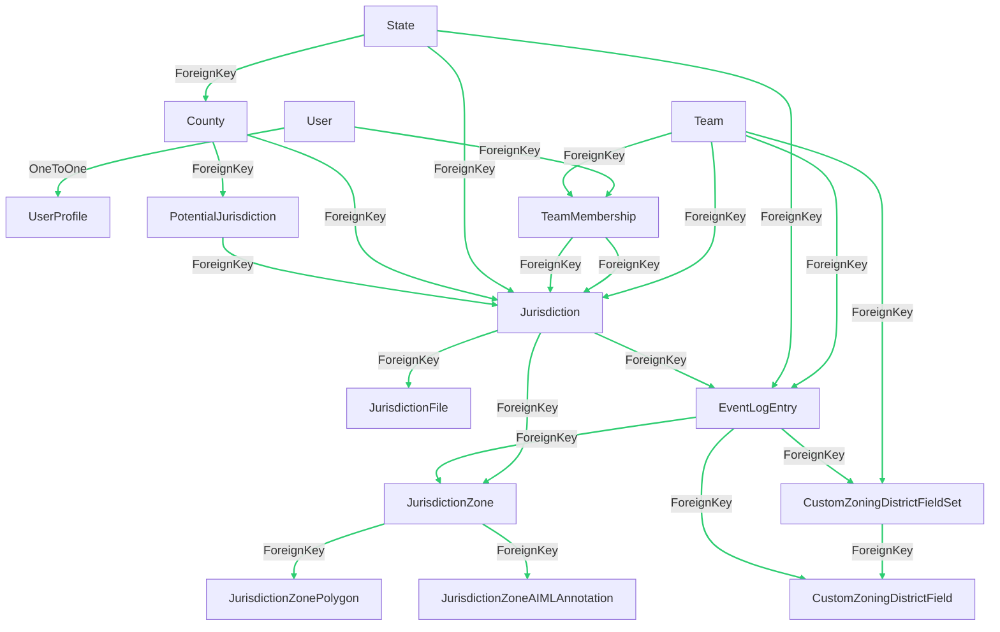

# will-it-ADU

Repo for final class project for CRP 5850: Mapping & Countermapping (FA22)

```mermaid
graph TB
  U["User"]
  T["Team"]
  UP["UserProfile"]
  TM["TeamMembership"]
  S["State"]
  C["County"]
  PJ["PotentialJurisdiction"]
  J["Jurisdiction"]
  JF["JurisdictionFile"]
  JZ["JurisdictionZone"]
  JZP["JurisdictionZonePolygon"]
  JZA["JurisdictionZoneAIMLAnnotation"]
  CZFS["CustomZoningDistrictFieldSet"]
  CZF["CustomZoningDistrictField"]
  ELE["EventLogEntry"]
  U -- "OneToOne" --> UP
  U -- "ForeignKey" --> TM
  T -- "ForeignKey" --> TM
  T -- "ForeignKey" --> J
  T -- "ForeignKey" --> CZFS
  T -- "ForeignKey" --> ELE
  TM -- "ForeignKey" --> J
  TM -- "ForeignKey" --> J
  S -- "ForeignKey" --> C
  S -- "ForeignKey" --> J
  S -- "ForeignKey" --> ELE
  C -- "ForeignKey" --> PJ
  C -- "ForeignKey" --> J
  PJ -- "ForeignKey" --> J
  J -- "ForeignKey" --> JZ
  J -- "ForeignKey" --> JF
  J -- "ForeignKey" --> ELE
  JZ -- "ForeignKey" --> JZP
  JZ -- "ForeignKey" --> JZA
  CZFS -- "ForeignKey" --> CZF
  ELE -- "ForeignKey" --> JZ
  ELE -- "ForeignKey" --> CZFS
  ELE -- "ForeignKey" --> CZF
  linkStyle 0 stroke:#2ecd71,stroke-width:2px;
  linkStyle 1 stroke:#2ecd71,stroke-width:2px;
  linkStyle 2 stroke:#2ecd71,stroke-width:2px;
  linkStyle 3 stroke:#2ecd71,stroke-width:2px;
  linkStyle 4 stroke:#2ecd71,stroke-width:2px;
  linkStyle 5 stroke:#2ecd71,stroke-width:2px;
  linkStyle 6 stroke:#2ecd71,stroke-width:2px;
  linkStyle 7 stroke:#2ecd71,stroke-width:2px;
  linkStyle 8 stroke:#2ecd71,stroke-width:2px;
  linkStyle 9 stroke:#2ecd71,stroke-width:2px;
  linkStyle 10 stroke:#2ecd71,stroke-width:2px;
  linkStyle 11 stroke:#2ecd71,stroke-width:2px;
  linkStyle 12 stroke:#2ecd71,stroke-width:2px;
  linkStyle 13 stroke:#2ecd71,stroke-width:2px;
  linkStyle 14 stroke:#2ecd71,stroke-width:2px;
  linkStyle 15 stroke:#2ecd71,stroke-width:2px;
  linkStyle 16 stroke:#2ecd71,stroke-width:2px;
  linkStyle 17 stroke:#2ecd71,stroke-width:2px;
  linkStyle 18 stroke:#2ecd71,stroke-width:2px;
  linkStyle 19 stroke:#2ecd71,stroke-width:2px;
  linkStyle 20 stroke:#2ecd71,stroke-width:2px;
  linkStyle 21 stroke:#2ecd71,stroke-width:2px;
  linkStyle 22 stroke:#2ecd71,stroke-width:2px;
```